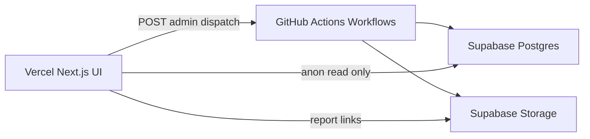

# DriftWatch

DriftWatch is a synthetic-first model drift monitoring platform built for a zero-cost stack.

It demonstrates production-shaped MLOps behavior:
- batch ingestion
- feature engineering
- baseline versioning
- feature drift detection
- prediction drift detection
- incident ticketing
- auditable run history

## Why this project exists

A common portfolio failure is building a strong model notebook but no production monitoring system.
DriftWatch focuses on the monitoring system itself.

This repo is intentionally designed to run on free tiers:
- Vercel (UI + secure admin dispatch)
- Supabase Free (Postgres + Storage)
- GitHub Actions (scheduled/manual compute)

## Current operating mode

### Synthetic-first (active)
The platform currently runs with `NORDEA_LIVE_READ=false`.
This means data is generated through realistic synthetic scenarios and processed through the same monitoring pipeline.

### Nordea live path (implemented, not active by default)
A live Nordea ingestion branch exists in `scripts/nordea_sync.py`, but sandbox authentication typically requires full OAuth consent/auth-code flow and TPP-grade setup.
Until that is implemented end-to-end, synthetic mode is the stable demo path.

## What Evidently is and why it is used

[Evidently](https://www.evidentlyai.com/) is an open-source library for ML monitoring and evaluation.

In DriftWatch, Evidently is used to compute feature drift between:
- baseline feature batch (reference)
- current feature batch (latest)

We use `Report(metrics=[DataDriftPreset()])` and then persist a compact report payload plus optional HTML artifact.

Why Evidently here:
- standardizes drift calculations across columns
- avoids custom, error-prone metric plumbing
- gives a stable report structure for storage/UI rendering
- is a common MLOps tooling choice in real teams

## End-to-end flow

1. Admin triggers workflow from `/admin`.
2. GitHub Actions runs compute scripts.
3. `generate_batch` or `nordea_sync` creates feature batches.
4. `baseline_refresh` trains model and updates baseline artifacts.
5. `monitor_run` compares baseline vs current:
   - feature drift (Evidently)
   - prediction drift (PSI over model score distribution)
6. Results are written to Supabase tables and artifacts uploaded to Storage.
7. UI reads Supabase with anon key (RLS read-only).

## Architecture



### Security model

- Browser: read-only via Supabase anon key + RLS.
- Vercel server routes: workflow dispatch only, no DB writes.
- GitHub Actions: only component with `SUPABASE_SERVICE_ROLE_KEY`, performs all writes.
- Admin auth: signed HTTP-only cookie (`dw_admin`) and server-side password check.

## Data model (important tables)

- `domains`: domain registry + worker heartbeat.
- `baselines`: baseline metadata, schema hash, model URI, baseline prediction distribution.
- `feature_batches`: current batch lineage (batch_id, scenario, storage_uri, source_mode).
- `monitor_runs`: run lifecycle, feature batch link, drift status, prediction drift score.
- `feature_drift_metrics`: per-feature stat test results.
- `action_tickets`: auto-created investigation/retrain tickets.
- `nordea_seed_runs`: seed execution audit trail.

## Synthetic scenarios

Implemented scenarios:
- `stable_salary`
- `inflation_shift`
- `subscription_spike`
- `income_drop`

These scenarios intentionally shift spend/income/rent/subscription dynamics so drift trend is non-flat over time.

## Prediction drift design

- Baseline refresh trains a logistic regression model (`StandardScaler + LogisticRegression`).
- Baseline prediction distribution (histogram) is stored in `baselines.baseline_predictions_json`.
- Monitor run scores current batch and computes PSI against baseline prediction distribution.
- PSI thresholds:
  - `< 0.10`: green
  - `0.10 - <0.25`: yellow
  - `>= 0.25`: red

## UI routes

Public:
- `/` dashboard
- `/runs`
- `/runs/[id]`
- `/tickets/[id]`

Admin:
- `/admin/login`
- `/admin`

Admin APIs:
- `POST /api/admin/run`
- `POST /api/admin/generate-batch`
- `POST /api/admin/sync`
- `POST /api/admin/seed`
- `POST /api/admin/baseline-refresh`

Read APIs:
- `GET /api/health`
- `GET /api/runs`
- `GET /api/runs/[id]`
- `GET /api/tickets/[id]`

## Workflows

- `generate_batch.yml`: scenario-based synthetic current batch generation.
- `nordea_sync.yml`: synthetic/live sync branch.
- `baseline_refresh.yml`: baseline rebuild + model training.
- `monitor_run.yml`: feature + prediction drift run.
- `nordea_seed.yml`: deterministic seed payload generation.
- `sweeper.yml`: stale run cleanup.
- `keepalive.yml`: optional health ping.
- `ci.yml`: lint, tests, build, python tests.

## Environment variables

### Vercel (public)
- `NEXT_PUBLIC_SUPABASE_URL`
- `NEXT_PUBLIC_SUPABASE_ANON_KEY`

### Vercel (server-only)
- `GITHUB_REPO`
- `GITHUB_REF`
- `GITHUB_DISPATCH_TOKEN`
- `ADMIN_PASSWORD`
- `ADMIN_COOKIE_SECRET`
- `APP_ORIGIN`
- `ALLOW_PREVIEW_ORIGINS`

### GitHub Actions secrets
- `SUPABASE_URL`
- `SUPABASE_SERVICE_ROLE_KEY`
- `DRIFTWATCH_STORAGE_BUCKET` (optional; defaults to `driftwatch-artifacts`)
- `NORDEA_ENV`
- `NORDEA_SIGNATURE_BYPASS`
- `NORDEA_CLIENT_ID`
- `NORDEA_CLIENT_SECRET`
- `NORDEA_TOKEN_URL`
- `NORDEA_API_BASE_URL`
- `NORDEA_ACCESS_TOKEN` (optional)
- `NORDEA_LIVE_READ` (`false` recommended for stable demo)
- `NORDEA_ACCOUNT_ID` (optional)

## Setup and runbook

## 1) Install dependencies

```bash
npm install
```

## 2) Apply schema

Run both in Supabase SQL editor:
- `supabase/schema.sql` (base)
- `supabase/migration_v2.sql` (upgrade)

## 3) Configure secrets/envs

- Vercel env vars (public + server-only)
- GitHub Actions secrets listed above

## 4) Recommended workflow sequence

1. `baseline_refresh` (`v1`)
2. `generate_batch` (`stable_salary`)
3. `monitor_run`
4. `generate_batch` (`inflation_shift`)
5. `monitor_run`

This produces visible trend variation and prediction drift differences.

## 5) Local checks

```bash
npm run lint
npm run test
npm run build
```

Python tests run in CI (`pytest tests/ -v`) after workflow deps are installed.

## Project status

Implemented:
- Synthetic scenario generation pipeline
- Feature batch lineage (`feature_batches`)
- Baseline model training + artifact storage
- Feature drift (Evidently)
- Prediction drift (PSI)
- Ticket creation on red runs
- Admin dispatch + read-only public UI
- Scenario-aware run history and detailed run pages

Deferred:
- Full Nordea OAuth consent/auth-code exchange
- TPP licensing / production PSD2 integration
- Fully themed dark mode (foundation added)

## Limitations

1. Live Nordea PSD2 flow is not fully wired end-to-end; synthetic mode is primary.
2. GitHub Actions provides batch execution, not low-latency stream processing.
3. Drift policy thresholds are currently global; per-feature policy config is a future enhancement.

## Future upgrades

1. Full OAuth consent + token lifecycle + secure token persistence.
2. Per-feature policy engine (thresholds, allowlist/blocklist, policy versioning).
3. Stronger QA checks (missingness spikes, row-count anomalies, schema/type guards).
4. Ticket lifecycle UI with acknowledge/resolve actions.
5. Expanded script test coverage and scenario simulation breadth.
